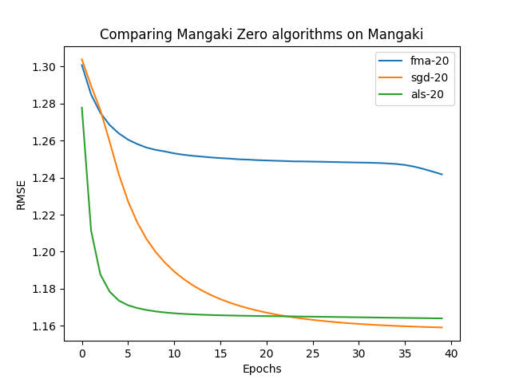
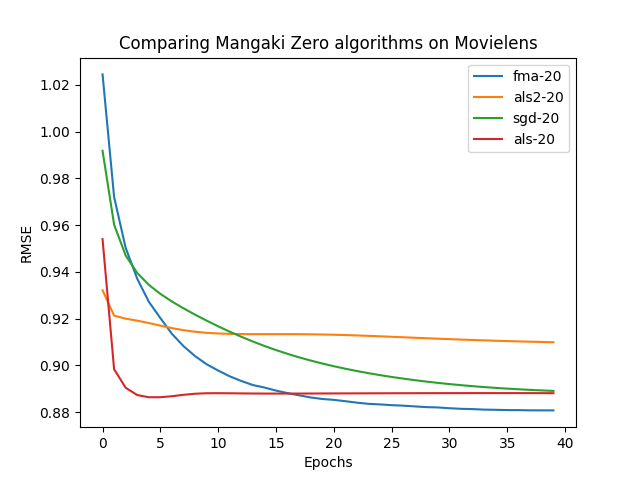

# Zero

Mangaki's recommendation algorithms.

They are tested on Python 3.6, 3.7, 3.8 over OpenBLAS LP64 & MKL.

## Usage

To run cross-validation:

1. Download a dataset like [Movielens 100k](http://files.grouplens.org/datasets/movielens/ml-latest-small.zip).
2. Ensure the columns are named `user,item,rating`:

user | item | rating
--- | --- | ---
3 | 5 | 4.5

For example, here, user 3 gave 4.5 stars to item 5.

3. Then run:

    python compare.py <path/to/dataset>

You can tweak the `experiments/default.json` file to compare other models.

## Custom usage

Most models have the following routines:

    from zero.als import MangakiALS
    model = MangakiALS(nb_components=10)
    model.fit(X, y)
    model.predict(X)

where:

- *X* is a numpy array of size `nb_samples` x 2
(first column: user ID, second column: item ID)
- and *y* is the column of ratings.

There are a couple of other methods that can be used for online fit, say `model.predict_single_user(work_ids, user_parameters)`.

See [zero.py](zero/zero.py) as an example of dumb baseline (only predicts zeroes) to start from.

## Results

### Mangaki data

### Movielens data

Feel free to use. Under GPLv3 license.
